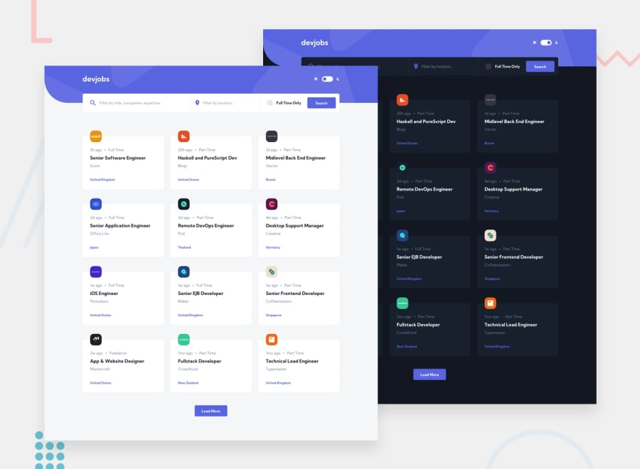

# Frontend Mentor - Devjobs web app

Live Link [Devjobs](https://devjobs-devubong.netlify.app/)

## The challenge

The challenge is to build out a jobs board using a local `data.json` to retrieve the data. The goal is to try to get the project looking as close to the design as possible.

## How to navigate this project

-  State management with Context API [Example Code 1](https://github.com/ubong-s/react-devjobs-webapp/blob/main/src/context/GlobalContext.js) [Example Code 2](https://github.com/ubong-s/react-devjobs-webapp/blob/main/src/context/globalReducer.js)
-  Responsive CSS using styled-components [Example Code](https://github.com/ubong-s/react-devjobs-webapp/blob/main/src/styles/globalStyle.js)
-  Design [Screenshots](https://github.com/ubong-s/react-devjobs-webapp/tree/main/src/design)
-  Animations added using [Framer Motion](https://www.framer.com/) [Example Code 1](https://github.com/ubong-s/react-devjobs-webapp/blob/main/src/App.js)

## Users should be able to:

-  View the optimal layout for each page depending on their device's screen size
-  See hover states for all interactive elements throughout the site
-  Be able to filter jobs on the index page by title, location, and whether a job is for a full-time position
-  Be able to click a job from the index page so that they can read more information and apply for the job
-  **Bonus**: Have the correct color scheme chosen for them based on their computer preferences. _Hint_: Research `prefers-color-scheme` in CSS.

## Improvements that can be made

-  Unit Testing
-  Work on the **Bonus** todo. Implement `prefers-color-scheme`
-  Refactor code, remove duplicate code especially in styles
